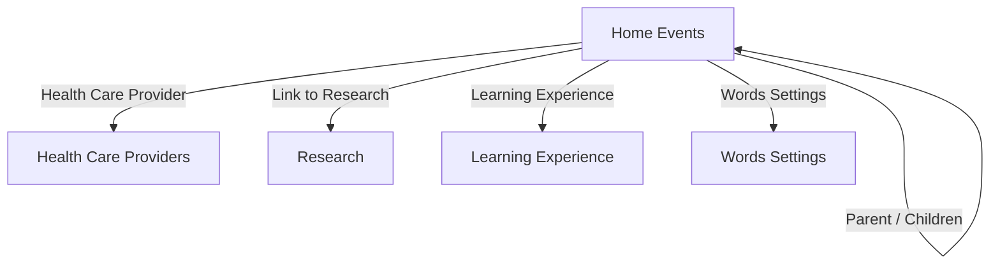

# Home Events data model

**Table:** Home Events (`tblYQbyKJJErXkZro`)  
**Base:** Home (`appSX4P3En4AWPyyG`)

## Core relationships

## Relationship semantics

| Relationship | Direction and purpose | Current state |
| --- | --- | --- |
| Parent | Self-link; one event may identify a parent event. | Active canonical workflow |
| Children (do not edit) | Self-link maintained by automation. | Active; do not edit manually |
| Health Care Provider | Links an event to one provider and exposes name, specialty, contact, map, and website lookups. | Active |
| Link to Research | Links event records to Research. | Active |
| Learning Experience | Links events to Learning Experience records. | Active |
| Words Settings | Links event records to a testing-window record. | Active |
| From field: Parent (Canonical), From field: Children (new), Prev Parent (new) | Coexisting self-links around the parent/children migration. | Legacy / unclear; preserve |

## Identity and timing

- **Name** is the primary formula identifier; users enter **Title**.
- **Start Time** and **End Time** use America/New_York.
- **Status** controls the event lifecycle: Pending, Scheduled, Completed, Archived, Cancelled.
- **Recurrence** and **Next Recurrence Date** drive same-record advance. The only current recurrence choices are Monthly, Annual, and Custom Days.

## External calendar model

**Add to Google** initiates creation; the resulting external identifier is retained in **G Cal Event ID**. Changes to watched event fields can set **Update GCal?**, which routes the record through the calendar-update workflow. This is an integration state machine, not a substitute for the event's own Status.
